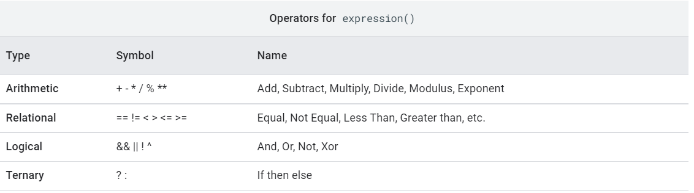

#   Objects and Methods
***
## Image

###Constant Image
```JS{.line-numbers}
// Create a constant image.
var image1 = ee.Image(1);
print(image1);

// Concatenate two images into one multi-band image.
var image2 = ee.Image(2);
var image3 = ee.Image.cat([image1, image2]);
print(image3);

// Create a multi-band image from a list of constants.
var multiband = ee.Image([1, 2, 3]);
print(multiband);

// Select and (optionally) rename bands.
var renamed = multiband.select(
    ['constant', 'constant_1', 'constant_2'], // old names
    ['band1', 'band2', 'band3']               // new names
);
print(renamed);

// Add bands to an image.
var image4 = image3.addBands(ee.Image(42));
print(image4);
```
**Image.select()也可以修改波段名称，不用挨个rename。参数可以有两种**
* 一种是任意数量的非列表参数。所有这些都将被当做为波段选择器。这些可以是波段名、正则表达式或数值索引。例如 select = image. select (‘ a’，‘ b’，3，‘ d’) ;
* 另一种是两个列表。第一个列表作波段选择器，第二个将用作所选波段的新名称。新名称的数量必须与选定的波段数量相匹配。例如 select = image. select ([‘ a’，4] ，[‘ newA’，‘ newB’]) ;

**[addBands()详解](./GEE%E5%9F%BA%E7%A1%8001.md/###image.addBands()详解)**


###掩膜
* **image.updateMask (maskImage)** 方法利用掩膜图像来更新image。掩膜中等于零的像素不参与计算，显示的时候不透明度被设置为0，即该像素masked。
```JS{.line-numbers}
// Mask the non-watery parts of the image, where NDWI < 0.4.
var ndwiMasked = ndwi.updateMask(ndwi.gte(0.4));
Map.addLayer(ndwiMasked, ndwiViz, 'NDWI masked');
```
**ndwi.gte(0.4)为掩膜图像，ndwi中值大于等于0.4的像元在掩膜图像中为1，否则为0**

* **image.selfMask()** 方法可以将图像中小于等于的0像元全部变为masked，大于零像元保持不变。
**文档中说的是非零像元被保留，但经过测试发现只有大于零的像元被保留，负像元也被masked**
```js
// Load a Landsat 8 image.
var image = ee.Image('LANDSAT/LC08/C02/T1_TOA/LC08_044034_20140318');

// Create NDVI and NDWI spectral indices.
var ndvi = image.normalizedDifference(['B5', 'B4']);
var ndwi = image.normalizedDifference(['B3', 'B5']);

// Create a binary layer using logical operations.
var bare = ndvi.lt(0.2).and(ndwi.lt(0));

// Mask and display the binary layer.
Map.setCenter(-122.3578, 37.7726, 12);
Map.setOptions('satellite');
Map.addLayer(bare.selfMask(), {}, 'bare.selfmask');
Map.addLayer(bare, {}, 'bare');
```
bare是0/1二值化图像，bare.selfMask()将所有0像元mask了，只剩下值为1的像元。

###Mosaicing(镶嵌)
使用imageCollection.mosaic()来将多幅影像镶嵌在一起，对于重叠的区域，像元值是imageCollection中最后的图像，即最后的图层位于最上层。
（其他理解：获取最后一个有值的像素，然后生成一张影像）
```js
// 将imageRGB, ndwiRGB两幅影像镶嵌
var mosaic = ee.ImageCollection([imageRGB, ndwiRGB]).mosaic();
Map.addLayer(mosaic, {}, 'mosaic');
```
**在imageRGB, ndwiRGB的重叠区域，像元值是后一个，即ndwiRGB的**
[代码1:Mosaic两个图像，重叠区域的像元值是imageCollection中最后的图像](https://code.earthengine.google.com/fa7bfbafd793a1dfea5c19628b013181)
[示例：将由NDWI提取出的水体和L8假彩色镶嵌](https://developers.google.com/earth-engine/guides/image_visualization#mosaicking)

###获取Metadata
```JS
// Load an image.
var image = ee.Image('LANDSAT/LC08/C02/T1/LC08_044034_20140318');
```
####设置属性
```js
image  = image.set('111testProperty','linjiexin')
print(image.propertyNames())
print(image.get('111testProperty'))
```

####获取波段名
```js
var bandNames = image.bandNames();
print('Band names:', bandNames);  // ee.List of band names
```

####获取band 1的投影信息
```js
var b1proj = image.select('B1').projection();
print('Band 1 projection:', b1proj);  // 返回的是一个ee.Projection object
```

####获取尺度信息
Get scale (in meters) information from band 1.
```js
var b1scale = image.select('B1').projection().nominalScale();
print('Band 1 scale:', b1scale);  // ee.Number

// Note that different bands can have different projections and scale.
var b8scale = image.select('B8').projection().nominalScale();
print('Band 8 scale:', b8scale);  // ee.Number
```

####Get a list of all metadata properties.
```js
var properties = image.propertyNames();
print('Metadata properties:', properties);  // ee.List of metadata properties
```
####获取特定的属性值
```js
var cloudiness = image.get('CLOUD_COVER');
print('CLOUD_COVER:', cloudiness);  // ee.Number
```


####获取时间戳并转化为Date对象.
```js
var date = ee.Date(image.get('system:time_start'));
print('Timestamp:', date);  // ee.Date
```
**注意**: 不同的波段可能有不同的投影信息和不同的尺度，所以在获取投影信息和尺度时，要先select('波段名')。

***

###图像运算
文档链接<https://developers.google.com/earth-engine/guides/image_math>

图像运算可以使用简单的image.add()|subtract()等运算符方法。对于复杂的运算，可以使用image.expression()。

####运算符方法
add()等运算符方法需要两个输入。两个输入可以是两个Image对象，也可以是一个Image对象加一个常数（常数被解释为一个无masked 像元的Constant Image）。

运算时，如果在某个位置的任一个输入有masked像元，则该位置的输出像元也是masked。只有两个输入都是unmasked的，该位置的输出像元才是unmasked。

**实例代码**
```js

// Load a 5-year Landsat 7 composite 1999-2003.
var landsat1999 = ee.Image('LANDSAT/LE7_TOA_5YEAR/1999_2003');

// Load a 5-year Landsat 7 composite 2008-2012.
var landsat2008 = ee.Image('LANDSAT/LE7_TOA_5YEAR/2008_2012');

// Compute multi-band difference between the 2008-2012 composite and the
// previously loaded 1999-2003 composite.
var diff = landsat2008.subtract(landsat1999);
Map.addLayer(diff,
             {bands: ['B4', 'B3', 'B2'], min: -32, max: 32}, 'difference');

// Compute the squared difference in each band.
var squaredDifference = diff.pow(2);
Map.addLayer(squaredDifference,
             {bands: ['B4', 'B3', 'B2'], max: 1000}, 'squared diff.');
```
当两个输入image的波段数相等时，各波段对按照顺序操作。如例子中的landsat2008的各个波段各自减去landsat1999中对应的波段。

当某个输入为单波段image时，另一个输入的所有波段都操作该单波段。如diff.pow(2)，diff的三个波段，每个波段都对单波段常数图像2进行操作。

####expression方法
对于复杂的运算，可以使用Imge.expression()方法。
如：计算增强植被指数时,增强植被指数evi表达式比较复杂，用上个实例中的代码比较繁琐，可以使用expression方法。
```js
// Load a Landsat 8 image.
var image = ee.Image('LANDSAT/LC08/C02/T1_TOA/LC08_044034_20140318');

// Compute the EVI using an expression.
var evi = image.expression(
    '2.5 * ((NIR - RED) / (NIR + 6 * RED - 7.5 * BLUE + 1))', {
      'NIR': image.select('B5'),
      'RED': image.select('B4'),
      'BLUE': image.select('B2')
});

Map.centerObject(image, 9);
Map.addLayer(evi, {min: -1, max: 1, palette: ['a6611a', 'f5f5f5', '4dac26']});
```
expression()方法有两个输入，一个是表达式，一个是字典。字典的作用是告诉服务器表达式和波段的对应关系。如：'NIR': image.select('B5')表示表达式中的NIR对应image的B5波段。

也可以只输入一个表达式，然后使用如下的方式表示波段： b("band name") or b(index), 这样可以不用输入字典。
```js
var evi = image.expression('2.5 * ((b(B5) - b(B4)) / (b(B5) + 6 * b(B4) - 7.5 * b(B2) + 1))');
```


文档中说，expression方法使用地板除，如10/20 = 0;如果需要避免地板除，则需要乘上1.0。如：10*1.0/20 = 0.5。

但经过测试，现在的expression已经不是地板除，可能是代码优化了，文档没改进。测试代码如下：
```js
var image1 = ee.Image(ee.Number(5));
var image2 = ee.Image(ee.Number(10));
var result =  image1.expression('img1/img2',{
  'img1':image1,
  'img2':image2
  
})
Map.addLayer(image1,{},"1");
Map.addLayer(image2,{},"2");
Map.addLayer(result,{},'result')
```



####关系运算、布尔运算、条件运算（三元运算符）
<https://developers.google.com/earth-engine/guides/image_relational#relational-and-boolean-operators>

**关系运算**包括eq(), gt(), gte(), lt(), lte()等
**布尔运算**包括and(),or(),not()等
**三元运算符：** 条件A？满足条件Ａ的结果:不满足条件Ａ的结果

###替换特定位置的像元值
使用image.where(test,value)方法,基于判断条件test的结果决定是否将像元改为value的值

**例子：使用其他影像来替换被云遮盖住的区域**
```js
// Load a cloudy Sentinel-2 image.
var image = ee.Image(
  'COPERNICUS/S2_SR/20210114T185729_20210114T185730_T10SEG');
Map.addLayer(image,{bands: ['B4', 'B3', 'B2'], min: 0, max: 2000}, 'original image');

// Load another image to replace the cloudy pixels.
var replacement = ee.Image(  'COPERNICUS/S2_SR/20210109T185751_20210109T185931_T10SEG');

var replacement2 = ee.Number(1);
// Set cloudy pixels (greater than 5% probability) to the other image.
var replaced = image.where(image.select('MSK_CLDPRB').gt(5), replacement);

// Display the result.
Map.setCenter(-122.3769, 37.7349, 11);
Map.addLayer(replaced,
             {bands: ['B4', 'B3', 'B2'], min: 0, max: 2000},
             'clouds replaced');

```
image.where(test,value),参数test是个图像，一般应该是个二值化图像，对于test值等于非零的，将像元值为value。test等于0的，保持原像元值。

如果在给定的输入像元位置，test或value被masked，则使用输入值。如果输入被屏蔽，则不执行任何操作。


##Feature

###基本运算

###常用函数
**注意：许多常用函数只有Feature和Geometry才有，如果想对FeatureCollection执行类似的操作，应该调用FeatureCollection.geometry()方法，先转化为geometry后再调用有关的方法**
####Simplify-简化矢量
Feature.Simplify()
简化几何体对象，降低内存占用，对复杂几何体特别有用
```js
  // Simplify
  var FAO15_adm0 = ee.FeatureCollection("FAO/GAUL_SIMPLIFIED_500m/2015/level0");
  // 通过过属性过滤找到某个具体的要素
  var China = FAO15_adm0.filter(ee.Filter.eq('ADM0_NAME','China'));
  print(China);
  Map.addLayer(China,{},'China');
  
  var China_simplify = China.geometry().simplify(5000);
  print(China.geometry());
  Map.addLayer(China_simplify,{'color':'red'},'China_simplify');
```
####Bounds-外接矩形 
Feature.bounds(),返回Feature的外接矩形。
***

##ImageCollection

###Aggregate_XXX

aggregate_xxx通常是ImageCollection或者FeatureCollection的方法。作用：指定一个集合中元素的属性，取出该集合中所有元素的这个属性，形成一个列表，然后返回该列表或计算该属性的统计值（均值、数量、方差等）。

举个例子，某ImageCollection中的每一个Image都有云覆盖率'CLOUD_COVER'这个属性。我们想知道这个ImageCollection中平均云覆盖率是多少，自然就要把每一张Image的'CLOUD_COVER'取出来，然后计算均值。可以利用ImageCollection.aggregate_mean('CLOUD_COVER')方法。

代码实例：
```JS

var col = ee.ImageCollection("LANDSAT/LC08/C02/T1_TOA")
  .filterBounds(ee.Geometry.Point([-122.073, 37.188]))
  .filterDate('2018', '2019');

// An image property of interest, percent cloud cover in this case.
var prop = 'CLOUD_COVER';

print('List of property values', col.aggregate_array(prop));
print('Count of property values', col.aggregate_count(prop));
print('Count of distinct property values', col.aggregate_count_distinct(prop));
print('First collection element property value', col.aggregate_first(prop));
print('Histogram of property values', col.aggregate_histogram(prop));
print('Min of property values', col.aggregate_min(prop));
print('Max of property values', col.aggregate_max(prop));

// The following methods are applicable to numerical properties only.
print('Mean of property values', col.aggregate_mean(prop));
print('Sum of property values', col.aggregate_sum(prop));
print('Product of property values', col.aggregate_product(prop));
print('Std dev (sample) of property values', col.aggregate_sample_sd(prop));
print('Variance (sample) of property values', col.aggregate_sample_var(prop));
print('Std dev (total) of property values', col.aggregate_total_sd(prop));
print('Variance (total) of property values', col.aggregate_total_var(prop));
print('Summary stats of property values', col.aggregate_stats(prop));

// Note that if the property is formatted as a string, min and max will
// respectively return the first and last values according to alphanumeric
// order of the property values.
//注意，如果属性是字符串，则min和max将根据属性值的字母数字顺序分别返回第一个和最后一个值。
var propString = 'LANDSAT_SCENE_ID';
print('List of property values (string)', col.aggregate_array(propString));
print('Min of property values (string)', col.aggregate_min(propString));
print('Max of property values (string)', col.aggregate_max(propString));
```

###dictinct
FeatureCollection/ImageCollection.distinct(properties)
作用是去除集合中相同的元素
properties是用来判断的指定属性。

如：想要去除ImageCollection中成像时间相同的函数，可以ImageCollection.distinct('system:time_start')。

**踩坑：distinct()的参数只能是集合中元素的属性**
我曾经试着把image的id作为判断条件，不成功。id不算在properies那一栏。